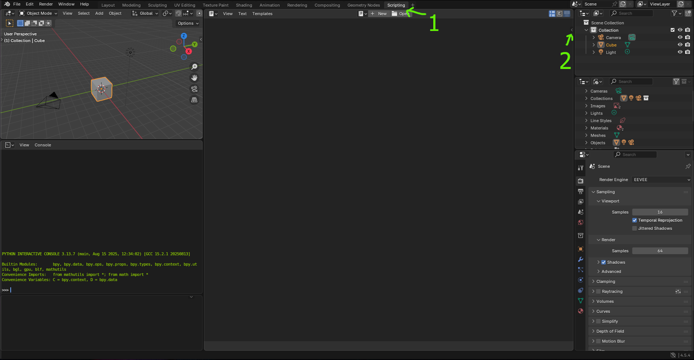
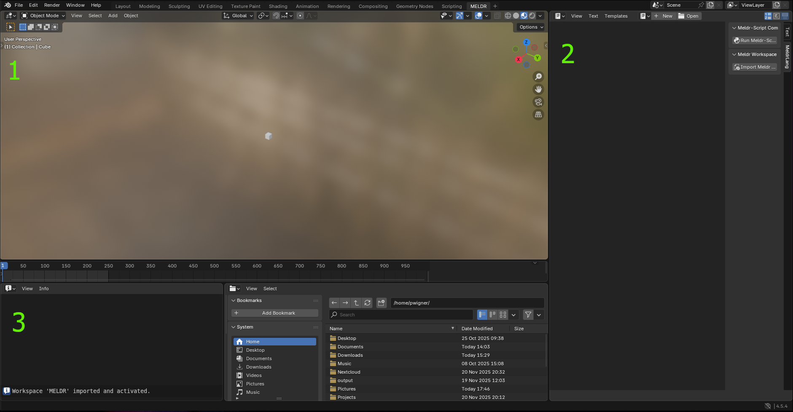

# Using the Meldr Add-On in Blender

After [installing](installation.md) the Meldr add-on for Blender, using it is relatively straightforward.

---

## Getting Started

### Setting up the Scripting Workspace

1. Navigate to the scripting workspace to quickly find a text editor window
2. Click the caret on the right side of the text editor to navigate to the Meldr add-on panel
3. Click "Import Meldr Workspace" to load a workspace optimized for Meldr scripting

---

## The Meldr Workspace

There are three main panels you'll use in the Meldr workspace:

1. **3D Viewport**: This is where the models and scenes you create will be viewed
2. **Text Editor**: You can click "New" or "Open" to create or load Meldr scripts into the text editor. To run a Meldr script, click the "Run-Meldr-Script" button on the Meldr add-on panel.
3. **Info Panel**: Blender displays a log of actions in this panel, but the Meldr-Lang compiler also outputs syntax or semantic errors here when trying to compile Meldr scripts.

---

## Tips & Tricks

- Clicking "Run-Meldr-Script" will load your scene and objects, while also starting the animation. To pause or play the animation, press the spacebar.
- If you're trying to open a `.meldr` file and don't see it in the file browser, click the filter icon (looks like a funnel) to disable filtering the file types.

---

## Next Steps

Ready to start writing scripts? Check out the [Meldr-Script Guide](script_quide.md) for detailed syntax and examples.