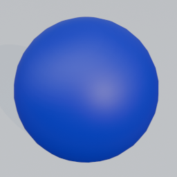
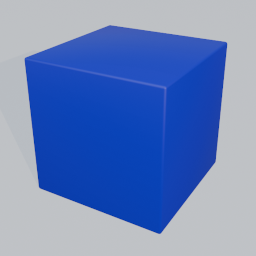
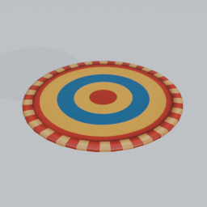
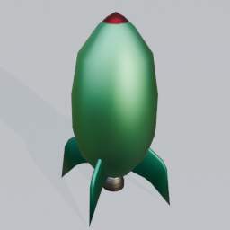
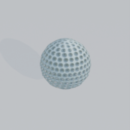
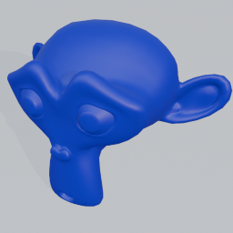
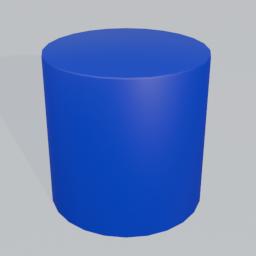
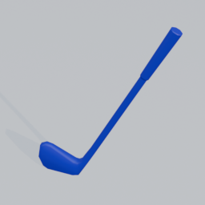
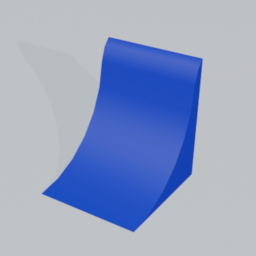

# Meldr-Script Guide 

Meldr-Script is a simple scripting language for creating scenes in Blender using the Meldr-Lang addon. Each script describes a *scene* made of *objects*.  Using a symple syntax, users can specify object's shape, colors, sizes, and positions. You do not need programming or 3d modelling experience. Meldr scripts are written in plain text and follow a simple structure.

---

## Basic Structure

Every file starts with a `SCENE` and ends with `END SCENE`. Inside this declaration, you can define one or more objects.

```meldr
SCENE MySceneName
    OBJECT myObject
        MODEL = SPHERE
        LOCATION = (0, 1, 2)
        COLOR = RED
    END OBJECT
END SCENE
```

- Scene names and object names can be anything (letters, numbers, underscores).
- Keywords are **not case sensitive** — `object`, `OBJECT`, and `ObJeCt` all work.

---

### Comments
Comments can help add descriptive information to your code that doesn't affect your 3D scene. Use `--` to begin a comment, and anything on the line that follows will be ignored

#### Example
```meldr
-- Comments can include information about your script
-- This scene was created to show the usefullness of comments
SCENE simpleScene
    OBJECT Suzanne
        MODEL = MONKEY -- The monkey model is a classic blender primative
        -- COLOR = BLUE
        -- The color property above will be ignored
    END OBJECT
END SCENE
```

---

### Levels

You can optionally specify a "level" for your scene. Levels add different environment the models are placed on, and often include a puzzle to be solved:

| Level | Puzzle Difficulty | Description |
|-------|------|-------------|
| `0`   | - | No environment, empty white surface |
| `1`   | Easy | Miniature golf course |
| `2`   | Hard | Tube slide sandbox |

If you don’t specify a level, **Level 0 is used by default**.

Example:

```meldr
SCENE Golf_Scene
    LEVEL 1
    ...
END SCENE
```

---

## Objects

Objects are created using `OBJECT <name>` and closed with `END OBJECT`.

Inside an object, you can specify *properties* like model type, location, rotation, size, color, and whether the object is dynamically animated by Blender's physics system.

Only `MODEL` is required to create an object.

#### Example

```meldr
OBJECT ball
    MODEL = SPHERE
    LOCATION = (1, 2, 3)
END OBJECT
```

You can repeat as many objects as you like inside a scene, but each property can only be defined once per object.

---

### Model Types

These define what 3D object is created. Below is a table of supported models. Images will appear here once added to the `/docs/img/models/` folder.

| Model Name | Image | Description |
|------------|-------|-------------|
| **SPHERE** |  | A simple round sphere, good for balls or rolling objects. |
| **CUBE** |  | A standard cube—useful as a general building block. |
| **BOUNCE_PAD** |  | A round flat surface that launches dynamic objects when hit. |
| **ROCKET** |  | A rocket-shaped object, better at falling than flying. |
| **GOLF_BALL** |  | Smaller than the `SPHERE` model, and with a dimpled texture. |
| **MONKEY** |  | Blender’s Suzanne model, Blender fans are bananas for this one. |
| **CYLINDER** |  | A basic cylindrical shape. Will roll if you rotate it on its side. |
| **GOLF_CLUB** |  | An animated golf club that will swing every few seconds to send objects flying. |
| **RAMP** |  | An angled surface for rolling or launching objects. |

---

### Locations (Coordinates)

Every object needs a position in 3D space so Blender knows where to place it. Meldr-Script uses a simple `(X, Y, Z)` system called [**Cartesian coordinates**](https://en.wikipedia.org/wiki/Cartesian_coordinate_system)

If you’ve never worked with coordinates before, think of them like directions:

<table>
  <tr>
    <td>

**Axis | Meaning**  
---|---  
**X** | Left / Right  
**Y** | Forward / Backward  
**Z** | Up / Down  

</td>
    <td>
<a title="Jorge Stolfi, Public domain, via Wikimedia Commons" href="https://commons.wikimedia.org/wiki/File:Coord_system_CA_0.svg"></a>
    </td>
  </tr>
</table>

#### Example

```meldr
LOCATION = (-1, 2, 5)
```

You can also label coordinates for clarity:

```meldr
LOCATION = (X=2, Y=-1.5, Z=4)
```

---

### Rotation

Rotation controls how an object is oriented in the scene.

#### Single-Value Rotation (Z‑Axis)
If you provide just one number, the object is rotated **only around the Z axis**. This effectively turns the object left/right, changing the direction it faces, while keeping it upright.

```meldr
ROTATION = 90   -- rotates 90° around Z
```

#### Full 3‑Axis Rotation (Euler Rotation)
You can rotate using a 3‑value vector to specify rotation around X, Y, and Z:

```meldr
ROTATION = (30, 90, 45)
```

This is known as **Euler rotation** and gives full control over orientation.

---

### Size

`SIZE` scales the object relative to its default size.

- `SIZE = 2` makes the object **twice as large**.
- `SIZE = 0.5` makes the object **half the normal size**.

Example:

```meldr
SIZE = 1.25
```

---

### Colors

Colors in Meldr can be set in three different ways, depending on how precise or convenient you want to be:

#### **1. Named Colors (Presets)**

These are simple predefined color names you can type directly.

| Color Name      | Example |
| --------------- | ------- |
| **BLACK**       | <span style="display:inline-block;width:40px;height:20px;background:#000;"></span> |
| **WHITE**       | <span style="display:inline-block;width:40px;height:20px;background:#fff;border:1px solid #ccc;"></span> |
| **RED**         | <span style="display:inline-block;width:40px;height:20px;background:#ff0000;"></span> |
| **GREEN**       | <span style="display:inline-block;width:40px;height:20px;background:#00ff00;"></span> |
| **BLUE**        | <span style="display:inline-block;width:40px;height:20px;background:#0000ff;"></span> |
| **YELLOW**      | <span style="display:inline-block;width:40px;height:20px;background:#ffff00;"></span> |
| **CYAN**        | <span style="display:inline-block;width:40px;height:20px;background:#00ffff;"></span> |
| **MAGENTA**     | <span style="display:inline-block;width:40px;height:20px;background:#ff00ff;"></span> |
| **ORANGE**      | <span style="display:inline-block;width:40px;height:20px;background:#ffa500;"></span> |
| **PURPLE**      | <span style="display:inline-block;width:40px;height:20px;background:#800080;"></span> |
| **PINK**        | <span style="display:inline-block;width:40px;height:20px;background:#ffc0cb;"></span> |
| **BROWN**       | <span style="display:inline-block;width:40px;height:20px;background:#8b4513;"></span> |
| **GRAY**        | <span style="display:inline-block;width:40px;height:20px;background:#808080;"></span> |
| **LIGHTGRAY**   | <span style="display:inline-block;width:40px;height:20px;background:#d3d3d3;"></span> |
| **DARKGRAY**    | <span style="display:inline-block;width:40px;height:20px;background:#404040;"></span> |
| **NAVY**        | <span style="display:inline-block;width:40px;height:20px;background:#000080;"></span> |
| **ROYALBLUE**   | <span style="display:inline-block;width:40px;height:20px;background:#4169e1;"></span> |
| **SKYBLUE**     | <span style="display:inline-block;width:40px;height:20px;background:#87ceeb;"></span> |
| **STEELBLUE**   | <span style="display:inline-block;width:40px;height:20px;background:#4682b4;"></span> |
| **LIME**        | <span style="display:inline-block;width:40px;height:20px;background:#32cd32;"></span> |
| **FORESTGREEN** | <span style="display:inline-block;width:40px;height:20px;background:#228b22;"></span> |
| **SEAGREEN**    | <span style="display:inline-block;width:40px;height:20px;background:#2e8b57;"></span> |
| **OLIVE**       | <span style="display:inline-block;width:40px;height:20px;background:#808000;"></span> |
| **MAROON**      | <span style="display:inline-block;width:40px;height:20px;background:#800000;"></span> |
| **CRIMSON**     | <span style="display:inline-block;width:40px;height:20px;background:#dc143c;"></span> |
| **SALMON**      | <span style="display:inline-block;width:40px;height:20px;background:#fa8072;"></span> |
| **CORAL**       | <span style="display:inline-block;width:40px;height:20px;background:#ff7f50;"></span> |
| **VIOLET**      | <span style="display:inline-block;width:40px;height:20px;background:#ee82ee;"></span> |
| **INDIGO**      | <span style="display:inline-block;width:40px;height:20px;background:#4b0082;"></span> |
| **PLUM**        | <span style="display:inline-block;width:40px;height:20px;background:#dda0dd;"></span> |
| **GOLD**        | <span style="display:inline-block;width:40px;height:20px;background:#ffd700;"></span> |
| **KHAKI**       | <span style="display:inline-block;width:40px;height:20px;background:#f0e68c;"></span> |
| **TAN**         | <span style="display:inline-block;width:40px;height:20px;background:#d2b48c;"></span> |

---

#### **2. Percentage-Based RGB**

To mix your own colors, use three values representing **Red, Green, and Blue as percentages (0–100%)**.
```meldr
COLOR = (35%, 90%, 10%)
```
Similar to `LOCATION` and `ROTATION`, you can optionally include tags to make reading the property details easier.

```meldr
COLOR = (R=35%, G=90%, B=10%)   -- Also valid syntax
```

---

#### **3. Hexadecimal Mode (Advanced)**

You can also use a six‑digit hex color code, just like in CSS or HTML.  Just include a `#` followed by your hexidecimal value;
```meldr
COLOR = #ff00ff
```

---

### Dynamic vs Static Objects

Objects can be **dynamic** (affected by Blender’s physics) or **static**:

```meldr
DYNAMIC = TRUE
DYNAMIC = FALSE
```

Dynamic objects fall, roll, collide, etc. Static objects can be collided with, but will stay at their original location.

---

## Full Example

```meldr
-- Sample Scene Created on 11/23/2025
SCENE sample_scene

    OBJECT small_ball
        MODEL = SPHERE
        LOCATION = (-1, 1, 35)  -- I want the ball to drop from high up
        SIZE = 0.2              -- Lets make the ball tiny
        DYNAMIC = TRUE
        COLOR = (1.1, 92.1, 15)
    END OBJECT

-- The ball will roll down the first ramp and launch of the second

    OBJECT ramp_1
        MODEL = RAMP
        LOCATION = (0.69, 0.43 , 0)
        ROTATION = 70
        COLOR = #ff00ff
        DYNAMIC = FALSE
    END OBJECT
    
    OBJECT ramp_2
        MODEL = RAMP
        LOCATION = (2.82, -0.17 , 0)
        SIZE = 0.5
        ROTATION = -110
        COLOR = coral
        DYNAMIC = FALSE
    END OBJECT

END SCENE
```

---


## Naming Rules

Valid names for objects and scenes:
- must start with a letter  
- can contain letters, numbers, and `_`

Examples:
```
player1
ball_large
MyObject
```

Invalid:
```
3dShape   (starts with a number)
object-name (hyphens not allowed)
```

---